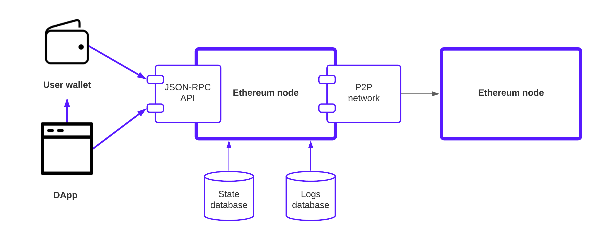

# Overview and architecture

### Classical Ethereum setup

To understand how EVM works on Telos, we need to first look at how EVM based dapps usually work.

Below is an illustration of a classical EVM decentralized app design. Both the dapp and user wallet connects to an Ethereum node that provides API services over JSON-RPC protocol. The Ethereum node manages the state (accounts and balances) and logs (queries of events) for its API user in internal databases (state database and logs database respectively).

The two EVM databases are

* **State database** that store the current network state which is accessible to the smart contracts. Smart contracts have the ability to update and read data from the database.
* **Logs database **that stores the past Solidity events. It is mainly used for token transfers, centralized exchange integration and dapp transaction histories. Smart contracts cannot access logs.

Dapps communicate with the user wallet over [in-browser ](https://docs.metamask.io/guide/ethereum-provider.html)or [WalletConnect](https://walletconnect.org) protocols. Both user wallet and dapps communicate with Ethereum JSON-RPC API to get the blockchain state and logs.

### Telos EVM design

EVM is implemented on Telos as a smart contract: all activities that would normally be run by the EVM on an Ethereum node are run by a smart contract on the Telos blockchain. An Ethereum compatibility JSON-RPC server provides the API Ethereum applications are expecting. It does this by translating the native Telos state from the EVM smart contract to Ethereum expected format.

Here are some of the main differences.

* Since the EVM is just another smart contract on the Telos blockchain, multiple EVMs can exist on the same chain at the same time. They are differentiated by their Telos account name.&#x20;
* Telos does not have the concept of logs, whereas Ethereum nodes provide the built-in eth\_getLogs call to query logs. Telos has logs query/streaming and history management as an external service called [Hyperion](https://eosrio.io/hyperion/).
* EVM transactions need to be able to pay native TLOS fees for transactions. This process is managed by the Ethereum compatibilbe JSON-RPC server that has a native Telos account associated with it. This account is used for broadcasting transactions to the EVM contract. &#x20;
* EVM smart contract uses native TLOS token as gas instead of ETH. More can be read on gas fees [here](gas-fees.md).

### Other similar projects

A similar approach is followed by the [Near blockchain](https://github.com/aurora-is-near/aurora-engine) to construct an EVM from smart contracts.
