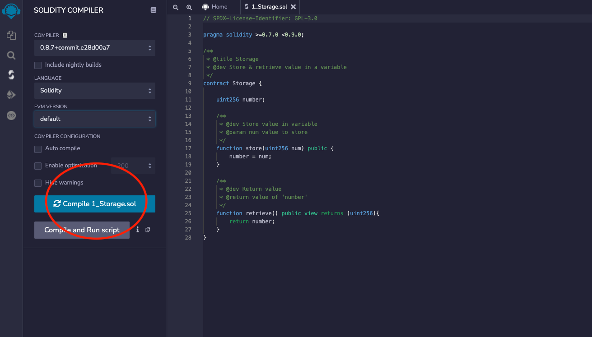

# Developing & Deploying Smart Contracts for tEVM

This section is aimed at jumpstarting new Telos EVM (tEVM) developers. If you are totally new to developing on an EVM, we recommend reading the official [Ethereum docs](https://ethereum.org/en/developers/docs/) to get started or you can navigate to the [external developer documents](broken-reference).

Telos makes developing and deploying to tEVM very easy for developers transitioning from other EVMs to the tEVM. All your favorite tools for developing and deploying smart contracts for Ethereum-based smart contracts on Solidity and Vyper are compatible with tEVM. This includes [Hardhat](https://hardhat.org/getting-started/), [Remix](https://remix.ethereum.org), and [Truffle](https://www.trufflesuite.com/docs/truffle/overview).

### Telos mainnet and testnet development

To deploy your smart contract on the tEVM, simply configure the correct network settings when you are ready to deploy. The table below provides the necessary information for the Telos EVM mainnet and testnet's respectively.

| **Settings**       | **Mainnet**                                                    | **Testnet**                                                                  |
| ------------------ | -------------------------------------------------------------- | ---------------------------------------------------------------------------- |
| RPC URL            | [https://mainnet.telos.net/evm](https://mainnet.telos.net/evm) | [https://testnet.telos.net/evm](https://testnet.telos.net/evm)               |
| Chain ID           | 40                                                             | 41                                                                           |
| Block explorer URL | [teloscan.io](https://www.teloscan.io)                         | [https://testnet.telos.net/v2/explore](https://testnet.telos.net/v2/explore) |


Websocket support is coming soon!


### Example:  Contract deployment for Remix

This example demonstrates how to deploy a simple Solidity contract on the Telos EVM testnet using **Remix**.&#x20;

* [Add the Telos EVM network](../../users/getting-started-with-telos-accounts/creating-an-evm-address-in-telos-wallet.md#connecting-metamask) as a custom RPC network in Metamask.
* **Open** [Remix](https://remix.ethereum.org). An example project with the following structure will be created for you. (We will only be working with the `1_Storage.sol` contract.)

* **Compile** the `1_Storage.sol` contract. Click on the `1_Storage.sol` contract to open it in the editor. Navigate to the Solidity compiler __ tab and click on the "Compile 1\_Storage.sol" button.

* **Deploy** the compiled contract. Navigate to the "Deploy & Run Transactions" tab and change the environment to "Injected Web3".&#x20;

.png>)

Make sure that you have selected the Telos EVM testnet in your Metamask and press the "Deploy" button.&#x20;

A page refresh might be required after enabling Metamask in order to select the "Injected Web3" option. A more in-depth description of how to deploy smart contracts using Remix can be found [here](https://remix-ide.readthedocs.io/en/latest/create\_deploy.html).

### Tutorials (deploy using Hardhat and Truffle)

For a guided tutorial on compiling and deploying your smart contract to tEVM using Hardhart and Truffle, follow the tutorials below:

* [Hardhat](https://hardhat.org/tutorial/deploying-to-a-live-network.html)
* [Truffle](https://trufflesuite.com/tutorial/)

### OpenZeppelin

OpenZeppelin provides contracts which helps you minimize risk by using battle-tested libraries of smart contracts for Ethereum and other blockchains. It includes the most used implementations of ERC standards. You can reduce the risk of vulnerabilities in your applications by using standard, tested and community-reviewed code.

Follow the link to get started using [OpenZeppelin](https://docs.openzeppelin.com) code in your smart contacts.

The next section will help you to verify your smart contact code using Sourcify for Teloscan.
