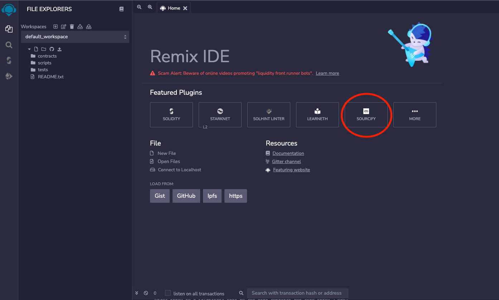

# Verifying Smart Contract source code

## Verifying your Smart Contract source code

_The following section was adopted from Sourcify Blog. You can read more About_ [_Sourcify_](https://sourcify.dev) _and their role in smart contract source code verification_ [_here_](https://blog.soliditylang.org/2020/06/25/sourcify-faq/)_._

Solidity contract source code can be verified by checking whether the on-chain deployed code is matching with published source code files. In order to allow for source verification, the source and metadata files need to be published, thus enabling developers to verify that the deployed bytecode is an exact match to the published files. By doing so, it can be verified that the contract code is exactly the same as when it was deployed on the blockchain and has not been adjusted or tampered with before deploying it.

#### _Why is source verification important?_

One of the decentralized web’s biggest aspirations is to build a trustless infrastructure, aiming to reduce the need to trust third parties and service providers and decreasing censorship opportunities. It should, by design, not be required to “blindly” trust a dapp developer or web3 project. It should always be possible to verify it for yourself, or if you’re not tech-savvy enough, leverage the power of the crowd of other developers who can look at and call out malicious code once it’s open source. Without open source contracts it is hard to tell what the application you are using will actually be doing.&#x20;

#### _Why should I publish my source code / open-source it?_ 

Closed source contract code cannot easily be verified since the trustless setup is not maintained if you have to rely on a third party which verifies the code for you. In that scenario, the verification service providers could be an attack vector and would need to be trusted.

### What is Sourcify

Sourcify is an initiative which aims to make interacting with smart contracts on the blockchain safer and more transparent for users.

To achieve this goal, Sourcify supports several efforts to foster adoption of open-source source verification, metadata files and NatSpec comments.

At its core, Sourcify currently maintains

* an [interface](https://sourcify.dev) that helps developers to verify metadata and contract source code.
* a [contract repository](https://repo.sourcify.dev) of all verified contracts.
* a [monitoring & verifier service](https://github.com/ethereum/sourcify) that checks for new contracts on Ethereum blockchains (mainnet and testnets) and tries to verify them automatically.

Sourcify basically provides the base layer, which allows other tools to be built on top of it. Its main purpose is to keep metadata and source files available via IPFS and Swarm (preventing that the links in the bytecode turn into dead links).

Besides the technical infrastructure, Sourcify is also a collective movement to bring transparency and awareness to the space. We try to educate and build bridges between development tools, wallets, interfaces and other components which all play an important role in demystifying interaction with smart contracts for the end user and hence making blockchain interactions safer.

## How to verify your source code on Sourcify

Your code can be verified a number of different ways depending on the IDE you use to write your code.&#x20;

Firstly you can verify you code directly at [https://sourcify.dev/verifier](https://sourcify.dev/verifier)

* Upload your smart contact code and metadata.
* Input the contract address you want to verify. If a contract at that address is verified in any of the chains it will be shown above.
* Select the chain the contract is deployed to.
* Click "Verify".

Secondly, after developing and deploying your smart contract using Remix, you can verify your code using the Sourcify plug-in provided. You just need to have the address of your smart contract at hand.&#x20;

* Click on the Sourcify plug-in to add it to the IDE.
* Navigate to the plug-in.
* Click on "Verifier".
* Choose the blockchain network form the drop-down menu (Telos EVM Mainnet or Telos EVM Testnet).
* Add the address.
* Click "Verify"

To verify your code using Hardhat or Truffle, you can read more [here](https://docs.sourcify.dev/docs/how-to-verify/), otherwise follow the steps mentioned above to directly verify your code at [https://sourcify.dev/verifier](https://sourcify.dev/verifier).

Alternatively, you can read more on how to verify your source code [here](https://help.telos.net/evm/how-to-verify-a-contract-on-telos-evm?from\_search=86541452).

## Benefits of verifying your code for Teloscan

****[**Teloscan**](https://www.teloscan.io) is Telos' EVM block explorer. Teloscan does not only provide a means to explore the Telos blockchain, but it also gives you the added benefit of interacting with _**verified**_ smart contracts that lives on Telos.

Teloscan introduces a new read/write function through an advanced control panel for any validated contract with the same abilities the dApp UI would offer, but in a **much** less user-friendly way.&#x20;

These new read/write features offer direct access to a smart contract. It allows execution of features unavailable in the UI or if the front end is down, which often happens for NFT mints or token sales.

#### With Teloscan Read/Write features you can:

* Call any read-only smart contract function without logging in, such as confirming token balances or decimal/symbol.
* Grant access to smart contracts even if your respective UI is unavailable. It also allows addresses linked to native accounts to interact as described above.
* Experienced users can use the write functions to send tokens.
* Enhanced overall read/write interface and added advanced decimal selection for token transactions.
* For any AMOUNT type of contract parameter, users can select the number of decimals and enter the amount. To make a token amount accurate, no need to “add 18 zeros” manually.
* Enhanced contract code view interface
* The code view is now alongside the Read/Write views for all validated contracts.

Additionally, Teloscan have been updated to support sign-in using Anchor and MetaMask. To read more about this and how it will benefit users, click [here](https://www.telos.net/news/telos-core-developers-shares-updates).

These features mentioned above are only available to verified smart contacts.&#x20;

## **Example of a verified / unverified smart contract**

When navigating to [Teloscan](https://www.teloscan.io), search for your smart contact by address. An unverified contract will look something like this:

An example of a verified contract can seen here: [https://www.teloscan.io/address/0xd2504a02fabd7e546e41ad39597c377ca8b0e1df](https://www.teloscan.io/address/0xd2504a02fabd7e546e41ad39597c377ca8b0e1df)

When your code has been verified, Teloscan allows you to have direct interaction with the smart contract. Click on "Contract" to view the code.

.png>)

Since this contract has been verified, using the "Read" and "Write" tabs, you or your users can have direct interaction with the smart contract.

 .png>)


#### Disclaimer

A verified contract simply stipulates that the source code can be scanned and verified via the explorer for any bugs/exploits/backdoors/etc. Beware that it does not automatically imply that there are not any bugs.&#x20;

Developers who have obvious back doors won't want to upload and verify their source code. Note that the green checkmark to imply that the code is audited against these, just that the code as you see it is verified.


